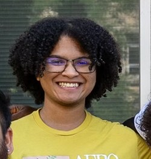

&nbsp; &nbsp; B.S. Biology 2025 
&nbsp; &nbsp; Southern New Hampshire University  
&nbsp; &nbsp; email: vinny.chloros [at] snhu [dot] edu 
&nbsp; &nbsp; [Resume](https://vchloros.github.io/SiteFiles/Resume/VChloros_ResumeV9Lab.pdf)

 
 
 
 

## About Me

 

As an undergraduate Biology student in my senior year, I'm gaining new experience in using R & RStudio for statistics and applying that knowledge to biology. In maintaining two repositories for my courses, I created a landing page to help display my work. 
I have examples of the work I've done for each of my courses here on GitHub: [Intro to Bioinformatics](https://vchloros.github.io/BIO422/BirdBaths.html) and [Statistical Learning & Classification](https://vchloros.github.io/MAT434/CA_VC.html).

 

## Current Projects

### Friends with Phylogeny: Approachable Software and Methodologies for Undergraduates Making Phylogenetic Trees

Bioinformatics has been and continues to cement itself as key pillar of biology as a whole. Despite that fact, many undergrads aren't exposed to fundamental skills and concepts that will become vital, both in furthering education and in future careers. As someone who is primarily interested in evolutionary biology, I found that building phylogenetic trees was a good early introduction into bioinformatics into a topic of interest. However, there are a large variety of software and methods available for students intereseted in making trees, so starting out can be intimidating. As my senior year capstone at SNHU, I want to test different freely available phylogenetic tree-making software and rate them based on how easy they are to use from an undergraduate perspective and how reliable the resulting trees are when compared to an widely-accepted reference tree.

 

## Past Projects

### Children and Choices: Parental Investment Under Environment Nutrient Limitation

As a REU student at Iowa University, I worked under the Neiman Lab for 10 weeks in the summer of 2024. The lab investigates the evolution of sexual reproduction and questions the prevalence of it over asexual reproduction. They use a species of New Zealand Mudsnails (Potamopyrgus antipodarum) as a model since individuals come in both sexual and asexual variants. My research took place under PhD Candidate Briante Najev who hypothesized that environmental factors like nutrition impacted the survivability and fecundity of the snails, impacting the prominence of either reproductive tactic. I worked to validate a method of testing snail embryos for phosphorous quantity using acid digestion and ICP-MS. The results allowed us to draw conclusions on how parents allocated phosphorus between themselves and their offspring, noting that offspring had a much higher concentration of phosphorous between both variants.

[UIowa REU 2024 Landing Page](https://www.thinglink.com/scene/1877395414039134694)  

### Cryptozoology Meets Ecology: A Look into the Megalodon

[Megalodon Research Paper](https://vchloros.github.io/SiteFiles/Projects/Megalodon_PaperPDF.pdf)  
[Megalodon UGRD Presentation](https://vchloros.github.io/SiteFiles/Projects/Megalodon_ResearchPresentation.pdf) 
